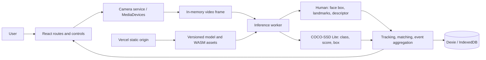

# VisionID AI architecture

## Runtime boundary

VisionID is a single-page React application. Vercel serves the built static files and versioned model assets. The browser owns camera permission, model inference, IndexedDB records, and CacheStorage. There is no application API server, cloud person directory, account system, Python runtime, telemetry, or camera-frame upload.



Live camera frames remain in browser memory and are released after inference. Only an explicitly enrolled face descriptor is stored in IndexedDB. Demo profiles have no descriptor. Events store labels, timestamps, boxes, and typed scores; exports omit biometric vectors and portraits by default.

## Client modules

| Area | Source | Responsibility |
| --- | --- | --- |
| Shell and routes | `src/app/`, `src/pages/` | Navigation, lazy route chunks, error boundary, landing, not-found state |
| Camera | `src/features/camera/` | Permission-gated `getUserMedia`, selected device/facing mode, track cleanup, disconnect recovery |
| AI runtime | `src/ai/engine/`, `src/ai/worker/` | Load pinned models, choose browser backend, transfer downscaled frames, normalize real model output |
| Recognition | `src/ai/recognition/` | Face quality heuristics, duplicate review candidates, conservative descriptor matching |
| Tracking and fusion | `src/ai/tracking/`, `src/ai/fusion/` | Temporary box tracks, face/person association, event deduplication |
| QR | `src/features/qr/` | Generate/scan QR, validate versioned JSON, safe manual paste fallback |
| Enrollment | `src/features/enrollment/` | Preview, consent, guided quality-gated samples, descriptor persistence |
| People | `src/features/people/` | Search, profile, update, delete cascade, re-enrollment entry |
| History and analytics | `src/features/history/`, `src/features/dashboard/` | Local event filters, exports, demo-labelled aggregates, measured session metrics |
| Settings and privacy | `src/features/settings/` | Thresholds, processing presets, cache and data lifecycle controls |
| Data | `src/data/` | Versioned Dexie schema, typed repositories, seed fixtures |

## Route map

| Route | Purpose |
| --- | --- |
| `/` | Product overview, privacy boundary, optional fictional demo seed |
| `/console` | Vision Fusion: face analysis, enrolled-only matching, object results |
| `/objects` | Object-only camera console |
| `/enroll` | QR/manual profile preview and opt-in face enrollment |
| `/people` | Local profile directory |
| `/people/:personId` | Profile details, history, edit and re-enroll actions |
| `/history` | Filtered local event list and redacted exports |
| `/settings` | Thresholds, camera and local data management |

Vercel rewrites client routes to `index.html`; a refresh on `/settings` or `/people/example` returns the SPA shell and React Router resolves the route.

## Frame and result lifecycle

1. A user presses Start Vision; only then does the camera service request permission.
2. The video element stays local. `InferenceLoop` runs serially at the configured interval and never queues overlapping frames.
3. The worker creates a capped `ImageBitmap`, runs face and COCO object modules, returns typed boxes/scores/descriptors, and closes the bitmap.
4. Object detector confidence is preserved as `detectorConfidence`. Face identity comparison is a separate `recognitionSimilarity` produced by the matcher.
5. Every face is matched independently to non-demo enrolled templates. Below-threshold or ambiguous candidates remain Unknown.
6. Tracking assigns short-lived IDs to detections; IDs are not identities. In Fusion mode, a face box is associated with a COCO `person` track only when one track contains it unambiguously. The temporary link is shown separately and does not affect recognition.
7. Event aggregation prevents a row per rendered frame. Event writes transactionally discard person-linked events if their profile was deleted, and descriptor saves recheck the profile in the same transaction as the template write.
8. Optional last-seen profile timestamps go through Dexie repositories. If deletion wins while a frame is in flight, the result is downgraded to Unknown before display. The console derives FPS and latency from actual timestamps.
9. Stop, route change, device removal, and clear-all invalidate active work, stop media tracks, and discard frames.

## Data model

```mermaid
erDiagram
  PERSON ||--o{ FACE_TEMPLATE : enrolls
  PERSON ||--o{ DETECTION_EVENT : recognized_event
  VISION_SETTINGS ||--o{ APP_INSTANCE : configures
  PERSON {
    string id PK
    string personId
    string personIdCanonical logical_UK
    string name
    string role
    string department
    blob photoBlob_optional
    datetime consentRecordedAt
    boolean isDemo
  }
  FACE_TEMPLATE {
    string id PK
    string personId FK
    float_vector descriptor
    float quality
    string pose
    string modelId
  }
  DETECTION_EVENT {
    string id PK
    datetime timestamp
    string type
    string label
    string associatedPersonTrackId_optional
    float detectorConfidence_optional
    float recognitionSimilarity_optional
    json boundingBox_optional
    boolean isDemo
  }
  VISION_SETTINGS {
    string id PK
    float recognitionThreshold
    float objectThreshold
    integer inferenceIntervalMs
    string cameraId_optional
  }
```

`PersonProfile` is linked to multiple `FaceTemplate` rows and detection events. A versioned schema migration populates `personIdCanonical` using trimmed NFKC plus uppercase normalization. Create and edit operations check this index inside a read-write transaction, so case or Unicode-equivalent visible IDs cannot be saved concurrently. Person deletion is transactional and removes linked templates and events; stale in-flight template and event writes also verify the profile in a transaction. Settings are validated and stored as one current row. IndexedDB is local to a browser profile; there is no cloud backup.

## QR contract

Version 1 QR text is JSON with required `version: 1`, `person_id`, and `name`; optional role, department, email, phone, organization, and bounded plain-text metadata are accepted. Payloads are limited to 8 KiB UTF-8. Unknown root fields, photos, descriptors, invalid email, case/Unicode-equivalent duplicate IDs, and unsupported versions are rejected before preview. Scanning does not save a profile; user review and a separate consent action are required.

## Model and delivery boundary

The app uses `@vladmandic/human` 3.3.6 for BlazeFace, FaceMesh, and HSE FaceRes descriptors; COCO-SSD 2.2.3 with `lite_mobilenet_v2` for the 80 COCO categories; TensorFlow.js 4.22.0 backends for WebGL/WASM/CPU fallback. Model files are versioned beneath `public/models/v1/` and served from the same origin. Their exact bytes are size/hash checked before a manifest allowlisted model cache write. The model inventory, class limits, and source/training-data terms are in [MODEL_NOTICES.md](MODEL_NOTICES.md).

The FaceRes architecture has VGGFace2 training provenance. Its upstream source marks the weights Apache-2.0, but VGGFace2 access terms restrict dataset use to non-commercial research. This build is for a local research/demo evaluation. Do not treat the MIT source-code license as permission to redistribute or commercialize the weights; obtain a rights determination or replace them before those uses.

## Testing boundary

`tests/e2e/appFlows.spec.ts` runs through an isolated Vite `e2e` mode and a deterministic test camera/model. The UI explicitly labels fixture results as test-only. The test adapter is selected only when both `MODE === "e2e"` and `VITE_E2E_TEST_ADAPTERS === "true"`; normal development and production modes use real camera/model adapters. Unit and integration tests cover the model adapter contracts, data repositories, matching, QR validation, settings, exports, and screen states. Real-device camera and inference checks must be performed on hardware; Playwright fixtures are not evidence of model accuracy or camera quality.

## Deployment

Vercel serves `dist/` as static content. Camera APIs require a secure context, which includes HTTPS and localhost. The app has no runtime environment variables, API keys, serverless functions, or database provisioning step. Build with `npm run build`; set the Vercel output directory to `dist` if automatic Vite detection does not select it. The SPA rewrite in `vercel.json` handles route refreshes.
